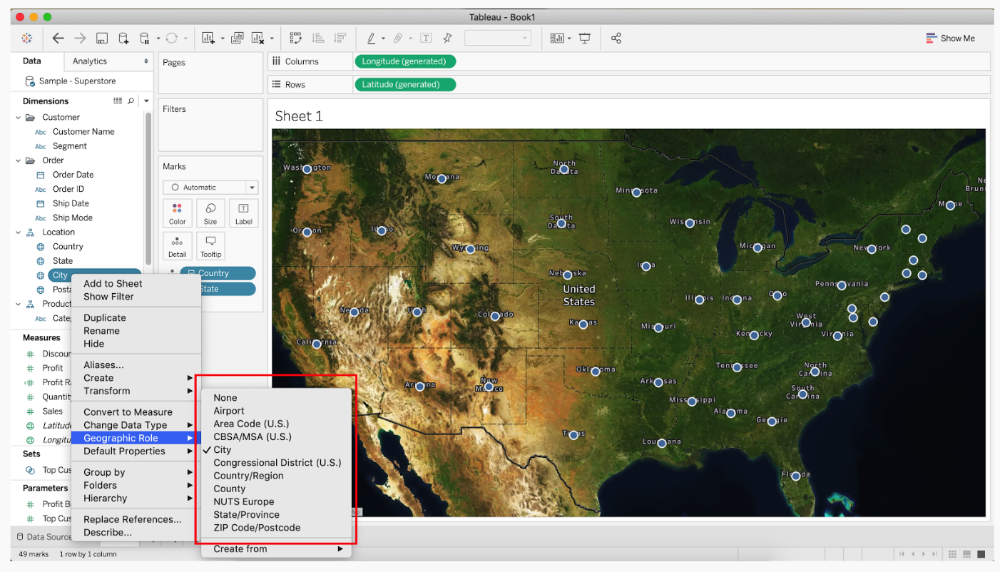
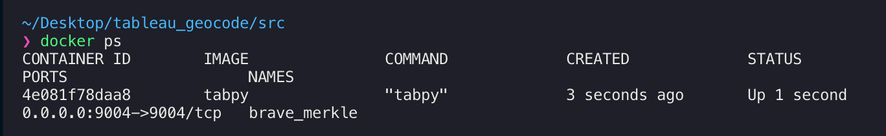
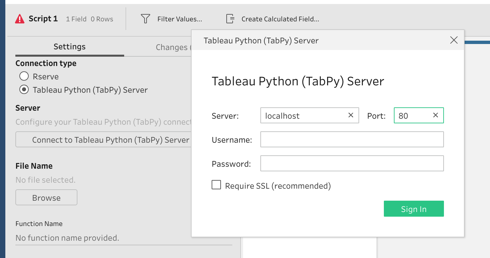
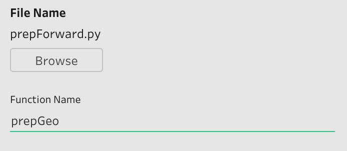

# Tableau Geocoding with Mapbox

This solution allows you to use Tableau Prep for performing forward and reverse geocoding, integrated via [TabPy](https://github.com/tableau/TabPy).

This repositoary also includes instructions for launching your own TabPy instance, there is a sample script for deploying this on AWS for testing and use at scale.

<!-- toc -->

- [Tableau Geocoding with Mapbox](#tableau-geocoding-with-mapbox)
  - [Geocoding](#geocoding)
  - [Usage](#usage)
    - [Prerequisites](#prerequisites)
    - [Build and Connect](#build-and-connect)
    - [Geocode with Prep](#geocode-with-prep)
  - [Forward Geocoding Requirements](#forward-geocoding-requirements)
  - [Reverse Geocoding Requirements](#reverse-geocoding-requirements)
  - [Customization](#customization)
    - [Customization Example](#customization-example)
    - [Rate Limiting](#rate-limiting)

<!-- tocstop -->

## Geocoding

Tableau Desktop and Prep already geocode for a specific set of geographies (known as Geographic Roles).



There are times users require either more granular data, or additional context about a location-related data point. You can enrich your data through geocoding:

- Forward: Query with text and receive a coordinate pair
- Reverse: Query with a coordinate pair and receive a location.

The Mapbox Geocoding API provides global scale and data coverage. It is also available to all users (no Enterprise Agreement required). For more information, consult the [Mapbox pricing page](https://www.mapbox.com/pricing/#geocode).

## Usage

To simplify setup and deployment, this solution wraps [TabPy](https://github.com/tableau/TabPy) in Docker. This enables cross-platform usage with minimal setup, while also reducing the amount of code a Tableau Desktop user must write.

The architecture is displayed below


### Prerequisites

1. Install Docker for your platform: [Mac](https://docs.docker.com/docker-for-mac/install/) / [Windows](https://docs.docker.com/docker-for-windows/)
2. Clone this repository

### Build and Connect

Once you have satistifed the prerequisites, run the following commands

```bash
cd src
docker build --tag tabpy .
docker run -d -p 80:80 tabpy
```

- docker build --tag tabpy: Build and tag your image as `tabpy` for running
- docker run -d -p 80:80 tabpy: Run the imaged `tabpy` in detached (`d`) mode, mapping the container port 80 to localhost 80 (`p 80:80`).

This will build and run the TabPy instance on your machine. To confirm that the image is running, either run `curl localhost/info` from your terminal or:

```bash
docker ps
```



Once you have confirmed that your image is running, open Tableau Prep 2019.3 (and above) and add a [Script node](https://help.tableau.com/current/prep/en-us/prep_scripts_TabPy.htm#add-a-script-to-your-flow).

Your configuration will look as follows:



This will connect Prep to TabPy.

### Geocode with Prep

The Dockerized version of TabPy includes a validated script (`geocode.py`) for running geocodes at scale. This is copied to TabPy on build.

This sample script, `prepForward.py` demonstrates forward geocoding. For more details about the response object read the [Geocoding API documentation](https://docs.mapbox.com/api/search/#geocoding-response-object).

```python
# This allows your script to access to published function
import sys
sys.path.append('/TabPy')
from geocode import geocodeForward

# This is the function you reference in Tableau Prep
def prepGeo(input):
    prepData = geocodeForward(input,"token")
    return prepData

# This is the output schema that is passed to Tableau Prep when geocoding is complete
def get_output_schema():
    return pd.DataFrame(
        {
            "InitialQuery": prep_string(),
            "ReturnAddress": prep_string(),
            "Accuracy": prep_string(),
            "Relevance": prep_decimal(),
            "Longitude": prep_decimal(),
            "Latitude": prep_decimal(),
        }
    )
```

This configuation configuration should look like this:



Once input, your geocoding process will complete and return new data to your flow.

## Forward Geocoding Requirements

The `prepGeo` function expects a single variable `input`. This variable MUST contain a column with an address string, with a column name of `Address`.

## Reverse Geocoding Requirements

The `prepGeo` function expects a single variable `input`. This variable MUST contain two columns, `Longitude` and `Latitude`. These columns can be of type float or string.

## Customization

The forward and reverse scripts default to a global search and a limit of one. This means that the geocoder will find the *optimal single result* for your query.

If you would like to refine your results, the Mapbox Geocoding API supports the following set of options.

| Type                | Filter            | Description                                                            |
|---------------------|-------------------|------------------------------------------------------------------------|
| Forward and Reverse | Country Filtering | Specify country or list of countries to restrict results               |
| Forward and Reverse | Limit             | Upper bound on number of results (max 10, default 1)                   |
| Reverse             | Type              | Specify the type of result to return (country, postcode, address, etc) |
| Forward             | Bbox              | Include only results that are within a given bounding box              |
| Forward             | Proximity         | Bias results that are closer to a given location                       |

For more details on these options, consult the [Geocoding API documentation](https://docs.mapbox.com/api/search/).

### Customization Example

For reverse geocoding, if you wish to filter to specific countries, you will either need to include a column in your data called "countries" (or similar) or hard code it into your script. All edits would need to be made to the [core geocoding script](src/geocode.py).

**Column-based approach**

```python
def geocodeReverse(input,token):
    url = "https://api.mapbox.com/geocoding/v5/mapbox.places-permanent/%s.json?access_token=%s&types=address&country=%s&limit=1"
    access_token = token
    input['coords'] = input['longitude'].map(str)+","+input['latitude'].map(str)
    coordinates = list(input["coords"])
    countries = list(input["countries"])
    urls = [url % (quote(list_item), access_token,countries) for list_item in coordinates]
```

**Hard code approach**

```python
def geocodeReverse(input,token):
    url = "https://api.mapbox.com/geocoding/v5/mapbox.places-permanent/%s.json?access_token=%s&types=address&country=%s&limit=1"
    access_token = token
    input['coords'] = input['longitude'].map(str)+","+input['latitude'].map(str)
    coordinates = list(input["coords"])
    countries = 'us'
    urls = [url % (quote(list_item), access_token,countries) for list_item in coordinates]
```

### Rate Limiting

The default rate limit for Geocoding API requsts is 600/minute. The included [Python scripts](src/geocode.py) enforce this limit with the [ratelimit](https://github.com/tomasbasham/ratelimit) package. If you exceed your rate limit, your results will fail. If you would like to know more about rate limiting, read the [Mapbox API documentation](https://docs.mapbox.com/api/#rate-limits).

```python
# This is the rate limit period in seconds
# Mapbox rate limits on a per-minute basis, with geocoding set at 600 requests per minute
RATE_LIMIT = 600
LIMIT_DURATION = 60

# Set up rate limiting for API calls
# If rate limit is exceeded, sleep the thread and wait until the LIMIT_DURATION has lapsed
# If you request an increased rate limit, update RATE_LIMIT above
@sleep_and_retry
@limits(calls=RATE_LIMIT, period=LIMIT_DURATION)
def req(url):
    try:
        with urlopen(url, context=ctx) as conn:
            return conn.read()
    except error.HTTPError as e:
        print(url)
```

`RATE_LIMIT` is the number of requests. `LIMIT_DURATION` is the amount of time that `RATE_LIMIT` is measured against.

Our estimate is that a single thread will approach `1200` records per minute, meaning that any `RATE_LIMIT` above that value will be redundant as the script cannot process that much data. You can achieve better performance with threading. This is achieved in the following line of code:

```python
with ThreadPoolExecutor(max_workers=1) as executor:
```

The parameter `max_workers=1` is how to control scale.  So if you have a `RATE_LIMIT` of `2400`, you can set `max_workers` to 2 split the work across two parallel threads leading to roughly half the time to completion. Parallelism will scale linearly, but there are diminishing returns as thread values increase.
